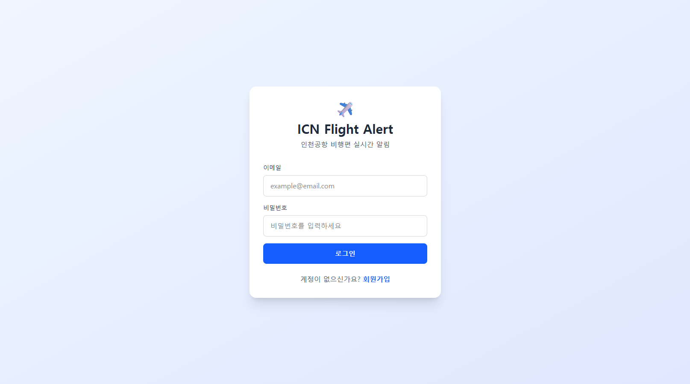
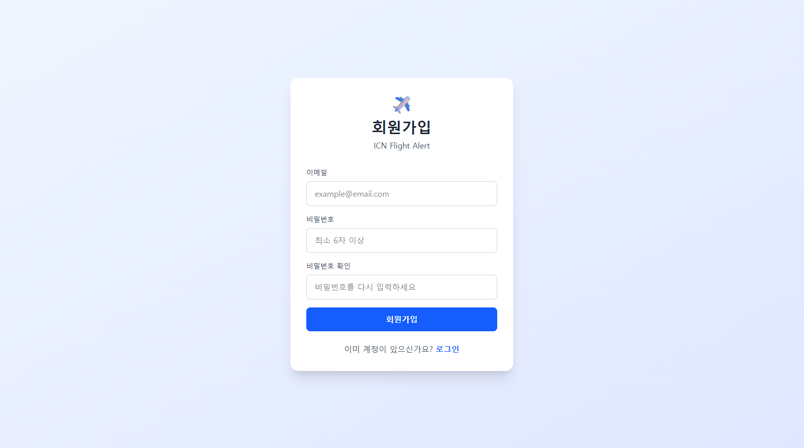
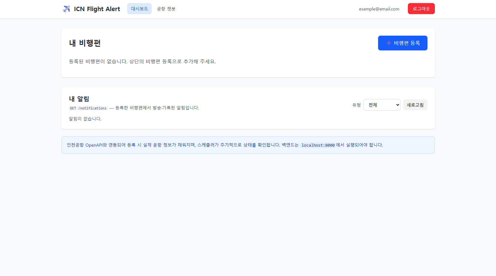
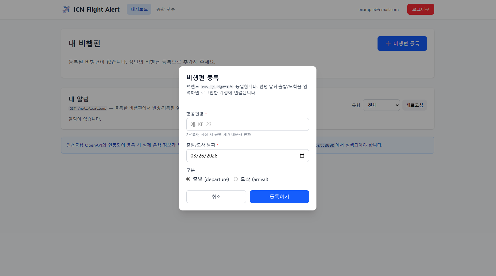
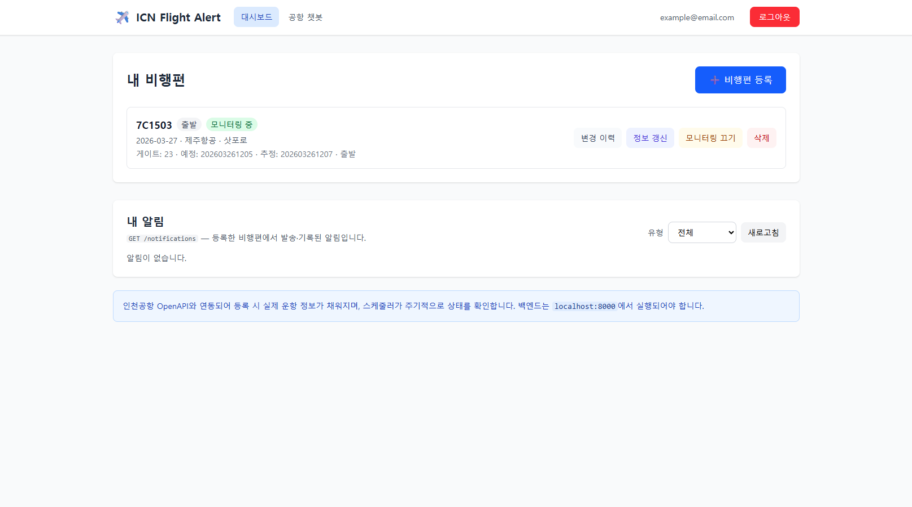
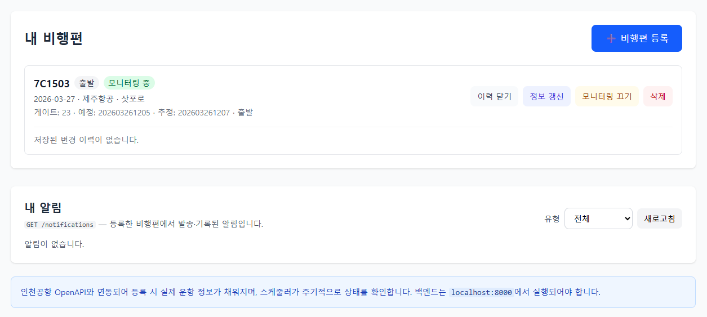
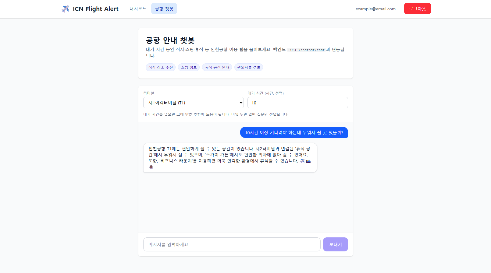

# ✈️ ICN Flight Alert — Frontend

**ICN Flight Alert** 백엔드 API와 연동하는 **React + Vite** 기반 웹 클라이언트입니다. 인천공항 비행편 등록·모니터링, 알림·변경 이력 조회, 공항 안내 챗봇까지 브라우저에서 이용할 수 있습니다.

---

## 🛠 Tech Stack

* **Build Tool**: `Vite`
* **UI Library**: `React`
* **Routing**: `react-router-dom`
* **HTTP Client**: `axios` (JWT 인터셉터, `Authorization: Bearer`)
* **Styling**: `Tailwind CSS` v4 (클래스 기반 다크 모드)
* **Language**: JavaScript (JSX)

---

## ✨ Key Features

### 🔐 인증

* **회원가입 / 로그인**: `POST /auth/signup`, `POST /auth/login`
* **JWT**: `localStorage`의 **`access_token`** 키에 저장, 요청 시 자동 첨부
* **로그아웃**: `POST /auth/logout` 호출 후 로컬 토큰 삭제 — 서버가 Bearer 토큰을 블랙리스트에 등록합니다 (백엔드 동작 유지).
* **세션 복구**: 앱 로드 시 `GET /me`
* **보호 라우트**: 대시보드·챗봇은 로그인 후에만 접근
* **로그인·회원가입 UI**: 비밀번호 **보기/숨기기**; 가입 완료 시 토스트 안내

### 📅 비행편 (대시보드)

* **목록**: `GET /flights` — `is_active`(전체·모니터링 중·비활성) 필터
* **등록**: `POST /flights`
* **상세**: `GET /flights/{flight_pk}` — 모달에서 터미널·체크인·캐러셀·마지막 갱신 시각 등
* **갱신**: `POST /flights/{flight_pk}/refresh` — 변경 요약 토스트
* **모니터링 on/off · 삭제**: `PATCH /flights/{pk}/status`, `DELETE /flights/{pk}`
* **변경 이력**: `GET /flights/{pk}/logs` — `change_type` 필터
* **이 비행편 알림**: `GET /notifications/flights/{flight_pk}`
* **내 알림(전체)**: `GET /notifications` — JWT 기준, `notification_type` 쿼리만 사용 (`user_email` 없음)

### 🤖 공항 챗봇

* **소개**: `GET /chatbot` — 기능 태그, 접기 가능한 `env` 안내
* **대화**: `POST /chatbot/chat` — 응답의 **mode**(LEGACY/RAG/AGENT) 뱃지, **sources** 링크 표시

### 🧭 공통 UI

* **레이아웃**: 네비·이메일·**다크/라이트 토글**·로그아웃
* **토스트**: 작업 결과·오류 알림 (우측 하단)

---

## 🏗 프로젝트 구조

```
src/
├── api/
│   ├── axios.js            # VITE_API_BASE_URL, JWT, 401(스마트 리다이렉트)
│   ├── auth.js             # signup / login / logout / fetchMe
│   ├── flights.js
│   ├── flightLogs.js
│   ├── notifications.js    # fetchMyNotifications, fetchFlightNotifications
│   └── chatbot.js
├── components/
│   ├── AppLayout.jsx       # 네비, 테마 토글, 로그아웃
│   ├── Modal.jsx, Spinner.jsx, Badge.jsx, Toaster.jsx
│   ├── FlightCard.jsx, FlightLogs.jsx, FlightNotifications.jsx
│   ├── FlightDetailsModal.jsx   # detailPk 있을 때만 마운트, GET /flights/{pk}
│   └── RegisterFlightModal.jsx
├── context/
│   ├── auth-context.js     # AuthContext (createContext만)
│   ├── theme-context.js
│   ├── toast-context.js
│   ├── AuthContext.jsx     # AuthProvider
│   ├── ThemeContext.jsx    # ThemeProvider
│   └── ToastContext.jsx    # ToastProvider
├── hooks/
│   ├── useAuth.js
│   ├── useTheme.js
│   └── useToast.js
├── pages/
│   └── LoginPage, SignupPage, DashboardPage, ChatbotPage (.jsx)
├── utils/
│   ├── apiError.js         # detail / success:false·error / TOKEN_* 보조
│   └── format.js           # formatIncheonDateTime, 갱신 요약 등
├── App.jsx                 # Provider: Theme → Auth → Toast → Routes
├── main.jsx
└── index.css               # Tailwind v4, @custom-variant dark
.env.example
```

### Provider 순서

`App.jsx`에서 **ThemeProvider → AuthProvider → ToastProvider** 순으로 감싼 뒤 `react-router` 라우트를 둡니다. 공개 페이지(로그인·회원가입)에서도 토스트·테마를 쓰기 위함입니다.

### Context / 훅 분리

Fast Refresh(`eslint-plugin-react-refresh`)과 맞추기 위해 **Context 객체**(`auth-context.js` 등)와 **Provider 컴포넌트**(`AuthContext.jsx` 등), **훅**(`hooks/useAuth.js` 등)을 파일 단위로 나눴습니다.

### 인증·호환

* 예전 `localStorage` 키 `token`을 쓰던 경우, 앱 기동 시 **`access_token`으로 한 번 옮기고** `token`을 제거합니다([`AuthContext`](src/context/AuthContext.jsx)).
* 비행편 **상세 모달**은 대시보드에서 `detailPk`가 있을 때만 마운트하며, `key={String(detailPk)}`로 편이 바뀔 때 상태를 초기화합니다.

---

## 📸 UI 스크린샷

### 1. 로그인



### 2. 회원가입



### 3. 대시보드 (빈 상태)



### 4. 비행편 등록 모달



### 5. 대시보드 — 비행편 목록



### 6. 대시보드 — 변경 이력·알림



### 7. 공항 안내 챗봇 (mode·sources)



---

## ⚙️ 사용법

### 사전 요구 사항

* **Node.js** (LTS 권장, 예: 20.x)
* **백엔드** `http://localhost:8000` (또는 `.env`에 맞는 URL)에서 실행 중

백엔드 `main.py`의 CORS에 프론트 출처(예: `http://localhost:5173`)가 허용되어 있어야 합니다.

### 환경 변수

프로젝트 루트에 `.env` 를 만들거나 [`.env.example`](.env.example) 을 복사합니다. (`.env` 는 `.gitignore`에 포함되어 커밋되지 않습니다.)

```env
VITE_API_BASE_URL=http://localhost:8000
```

미설정 시 코드상 기본값은 `http://localhost:8000` 입니다.

### 설치 및 실행

```bash
git clone https://github.com/your-org/icn-flight-alert-frontend.git
cd icn-flight-alert-frontend

npm install
npm run dev
```

브라우저에서 `http://localhost:5173` 접속 → **회원가입** 후 **로그인** → **대시보드**에서 비행편 등록·**공항 챗봇** 테스트.

### 빌드·미리보기

```bash
npm run build
npm run preview
```

배포 시 호스팅 환경에 `VITE_API_BASE_URL` 로 실제 API 도메인을 넣습니다.

### 스크립트

| 명령 | 설명 |
|:---|:---|
| `npm run dev` | 개발 서버 (HMR) |
| `npm run build` | 프로덕션 빌드 |
| `npm run preview` | 빌드 미리보기 |
| `npm run lint` | ESLint (React Hooks, React Refresh 등) |

배포·PR 전에 `npm run lint` 및 `npm run build` 로 확인하는 것을 권장합니다.

---

## 🚨 Troubleshooting

### CORS 오류 (Network Error)

* 백엔드 실행 여부와 `VITE_API_BASE_URL` 이 실제 API와 일치하는지 확인합니다.
* 개발 포트가 `5173`이 아니면 백엔드 CORS `origins`에 해당 URL을 추가합니다.

### 401 후 로그인 페이지로 이동

* 보호된 API에서 401이 나고 **이미 토큰이 있던 경우**에만 로컬 토큰을 지우고 `/login`으로 이동합니다.
* **`/auth/login`·`/auth/signup` 요청의 401**(로그인 실패 등)에서는 리다이렉트하지 않습니다.

### 로그아웃 후에도 이전 세션처럼 보임

* 로그아웃 시 `POST /auth/logout` 이 성공하면 해당 JWT는 서버 블랙리스트에 올라갑니다. 다른 탭에서는 새로고침 후 다시 로그인해야 할 수 있습니다.

### 챗봇만 응답이 없음

* 백엔드 `OPENAI_API_KEY` 및 RAG 관련 환경 변수를 확인합니다.

---

## 🔗 관련 저장소

* **Backend**: [icn-flight-alert](https://github.com/zynxquzo/icn-flight-alert) — FastAPI, PostgreSQL, JWT, 비행편·알림·챗봇 API

---

## 👨‍💻 Author

* GitHub: [@zynxquzo](https://github.com/zynxquzo)
