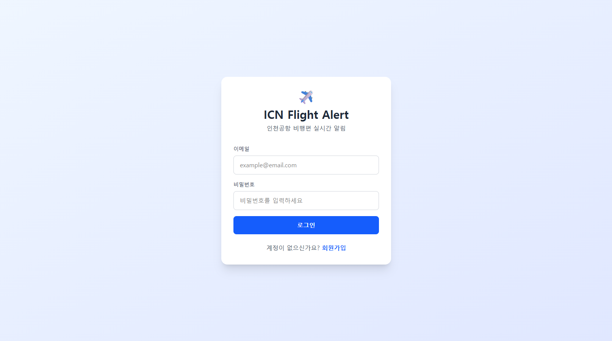
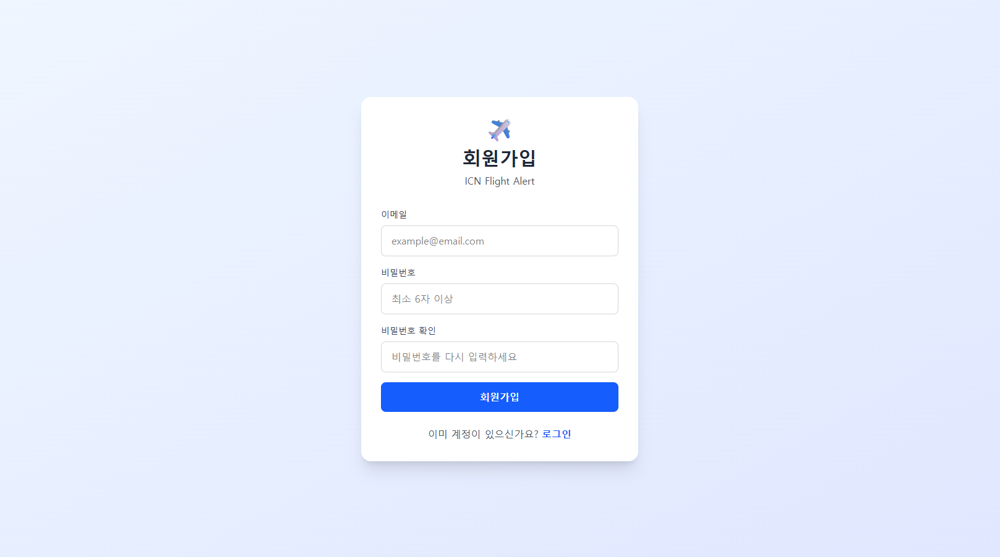
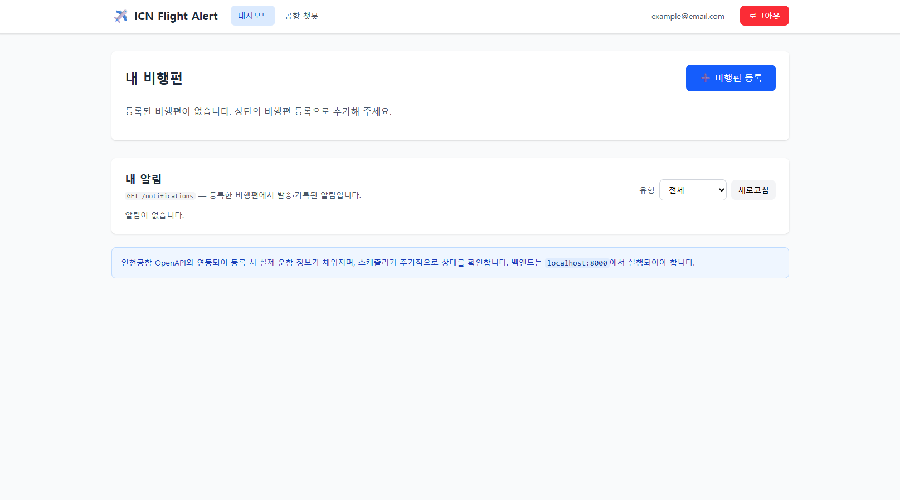
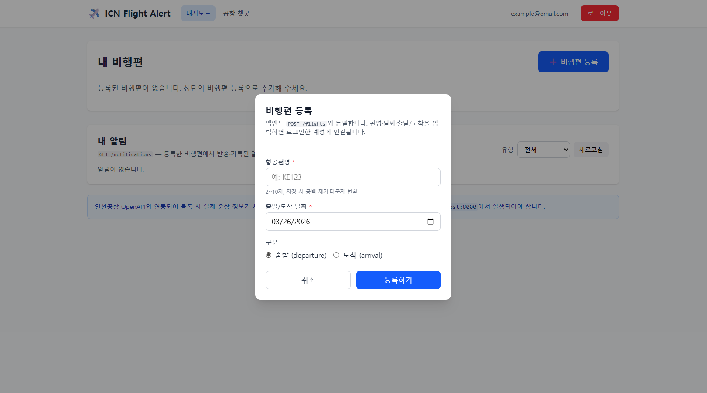
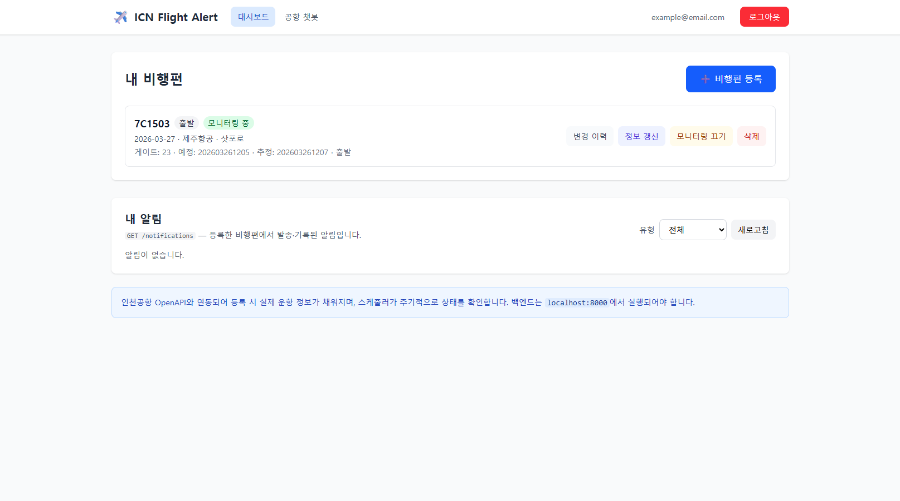
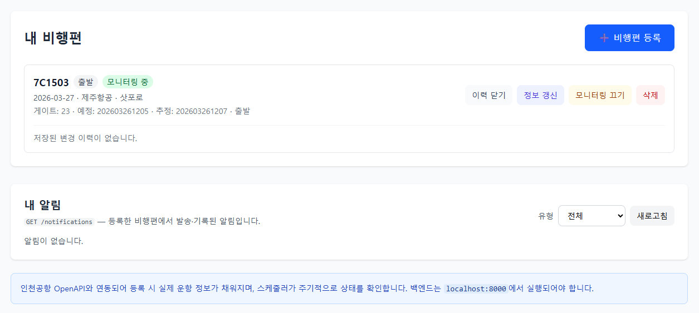
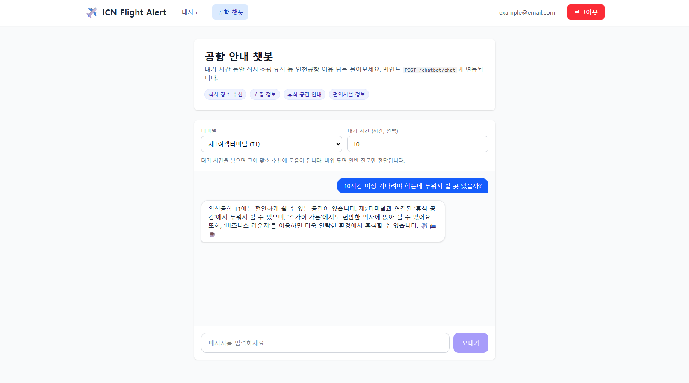

# ✈️ ICN Flight Alert — Frontend

**ICN Flight Alert** 백엔드 API와 연동하는 **React + Vite** 기반 웹 클라이언트입니다. 인천공항 비행편 등록·모니터링, 알림·변경 이력 조회, 공항 안내 챗봇까지 브라우저에서 이용할 수 있습니다.

---

## 🛠 Tech Stack

* **Build Tool**: `Vite`
* **UI Library**: `React`
* **Routing**: `react-router-dom`
* **HTTP Client**: `axios` (JWT·**리프레시 토큰** 재발급 인터셉터, `Authorization: Bearer`)
* **Styling**: `Tailwind CSS` v4 (클래스 기반 다크 모드)
* **Language**: JavaScript (JSX)
* **i18n**: `I18nProvider` + `src/i18n/messages.js` — 로그인·**대시보드·비행편 카드/상세/등록**·**챗봇** 등 주요 화면 **한국어 / English** (`t(key)` 및 `{변수}` 치환)
* **PWA**: `public/manifest.webmanifest`, `public/sw.js`, **`public/offline.html`** — 프로덕션 빌드 후 **설치 가능 앱** + **오프라인 시 최소 안내 페이지**(문서 내비게이션 실패 시; API는 네트워크 전용)

---

## ✨ Key Features

### 🔐 인증

* **회원가입 / 로그인**: `POST /auth/signup`, `POST /auth/login` — 응답에 **`access_token`** 과 **`refresh_token`**
* **저장소**: `localStorage`의 `access_token`, **`refresh_token`** (로그아웃·갱신 실패 시 함께 삭제)
* **401 처리**: 보호 API에서 401이면(로그인·가입·리프레시 등 제외) **`POST /auth/refresh`** 로 액세스 재발급 후 **원요청 1회 재시도**. 리프레시까지 실패하면 로컬 토큰 삭제 후 로그인 페이지로 이동 (`src/api/axios.js`)
* **로그아웃**: `POST /auth/logout` 후 `access_token`·`refresh_token` 삭제 — 서버에서 액세스 블랙리스트 + 해당 사용자 리프레시 폐기
* **비밀번호 찾기·재설정**: `/forgot-password`, `/reset-password?token=` → 백엔드 `forgot-password` / `reset-password`
* **이메일 인증**: `/verify-email?token=` → `GET /auth/verify-email`. 대시보드에서 **미인증 배너** 및 `POST /auth/resend-verification`
* **세션 복구**: 앱 로드 시 `GET /me` (`email_verified` 등 프로필 반영)
* **보호 라우트**: `/dashboard`, `/chatbot` 은 로그인 후에만 접근
* **로그인·회원가입 UI**: 비밀번호 **보기/숨기기**, 로그인에서 **비밀번호 찾기** 링크; 가입·인증 안내 토스트

### 📅 비행편 (대시보드)

* **목록**: `GET /flights` — `is_active`(전체·모니터링 중·비활성) 필터
* **등록**: `POST /flights`
* **상세**: `GET /flights/{flight_pk}` — 모달에서 터미널·체크인·캐러셀·마지막 갱신 시각 등
* **갱신**: `POST /flights/{flight_pk}/refresh` — 변경 요약 토스트
* **모니터링 on/off · 삭제**: `PATCH /flights/{pk}/status`, `DELETE /flights/{pk}`
* **변경 이력**: `GET /flights/{pk}/logs` — `change_type` 필터
* **이 비행편 알림**: `GET /notifications/flights/{flight_pk}`
* **내 알림(전체)**: `GET /notifications` — JWT 기준, `notification_type` 쿼리만 사용 (`user_email` 없음)
* **임박 비행편 자동 갱신**: **출발 예정이 3시간 이내**인 **활성** 비행편이 목록에 있으면, 스케줄러 주기와 별도로 **약 90초마다** `GET /flights`를 다시 호출해 목록을 갱신합니다.
* **비행편 상세 → 챗봇**: 상세 모달에서 **「이 터미널·대기 시간으로 챗봇 열기」** 로 `/chatbot?terminal=…&wait=…` 이동(예정·추정 시각 기준 대기 시간 추정)

### 🤖 공항 챗봇

* **소개**: `GET /chatbot` — 기능 태그, 접기 가능한 `env` 안내
* **대화**: `POST /chatbot/chat` — 응답의 **mode**(LEGACY/RAG/AGENT) 뱃지, **sources** 링크 표시
* **대시보드와 연동**: URL 쿼리 `terminal`(T1/T2), `wait`(시간)으로 들어오면 **최초 로드 시** 터미널·대기 시간에 반영하고, 쿼리는 `replaceState`로 정리합니다. 대화는 새 컨텍스트로 시작합니다([`ChatbotPage.jsx`](src/pages/ChatbotPage.jsx)).
* **대화·설정 유지 (세션·탭 단위)**: 동일 파일에서 대화 목록, 터미널, 대기 시간을 **`sessionStorage`**에 저장합니다.
  * 같은 **탭**에서 **새로고침**해도 위 내용이 복구됩니다.
  * **탭 또는 창을 닫으면** 브라우저가 `sessionStorage`를 비우므로 대화도 초기화됩니다 (서버에 영구 저장하지 않음).
  * 마지막 저장 시각 기준 **약 30분** 동안 메시지나 설정에 변화가 없으면 저장소와 화면이 초기화됩니다. 열린 탭에서는 주기적으로(기본 1분 간격) 만료 여부를 검사합니다.
  * 상수: `CHATBOT_SESSION_IDLE_MS`(무활동 만료), `IDLE_CHECK_MS`(만료 검사 주기) — 필요 시 [`ChatbotPage.jsx`](src/pages/ChatbotPage.jsx) 상단에서 조정합니다.

### 🧭 공통 UI

* **레이아웃**: 네비·이메일·**언어 KO/EN**·**다크/라이트 토글**·로그아웃 ([`AppLayout.jsx`](src/components/AppLayout.jsx), [`I18nContext.jsx`](src/context/I18nContext.jsx))
* **토스트**: 작업 결과·오류 알림 (우측 하단)

---

## 🏗 프로젝트 구조

```
public/
├── manifest.webmanifest   # PWA 메타
├── sw.js                  # 프로덕션에서만 등록 (precache + 오프라인 내비 폴백)
├── offline.html           # 오프라인 최소 UI (한·영 안내)
└── favicon.svg
src/
├── api/
│   ├── axios.js            # VITE_API_BASE_URL, JWT, 401 시 refresh 후 재시도
│   ├── auth.js             # signup, login, logout, fetchMe, forgot/reset/verify, resendVerification
│   ├── flights.js
│   ├── flightLogs.js
│   ├── notifications.js    # fetchMyNotifications, fetchFlightNotifications
│   └── chatbot.js
├── components/
│   ├── AppLayout.jsx       # 네비, i18n KO/EN, 테마 토글, 로그아웃
│   ├── Modal.jsx, Spinner.jsx, Badge.jsx, Toaster.jsx
│   ├── FlightCard.jsx, FlightLogs.jsx, FlightNotifications.jsx
│   ├── FlightDetailsModal.jsx   # detailPk 있을 때만 마운트, GET /flights/{pk}
│   └── RegisterFlightModal.jsx
├── context/
│   ├── auth-context.js     # AuthContext (createContext만)
│   ├── theme-context.js
│   ├── toast-context.js
│   ├── AuthContext.jsx     # AuthProvider (+ resendVerification)
│   ├── I18nContext.jsx     # I18nProvider (lang, t)
│   ├── ThemeContext.jsx    # ThemeProvider
│   └── ToastContext.jsx    # ToastProvider
├── hooks/
│   ├── useAuth.js
│   ├── useTheme.js
│   └── useToast.js
├── pages/
│   └── LoginPage, SignupPage, ForgotPasswordPage, ResetPasswordPage, VerifyEmailPage,
│       DashboardPage, ChatbotPage (.jsx)
├── utils/
│   ├── apiError.js         # detail / success:false·error / TOKEN_* 보조
│   └── format.js           # formatIncheonDateTime, 갱신 요약, 임박 폴링·챗봇 터미널 추정 등
├── i18n/
│   └── messages.js         # ko / en 문자열
├── App.jsx                 # Provider: I18n → Theme → Auth → Toast → Routes
├── main.jsx
└── index.css               # Tailwind v4, @custom-variant dark
.env.example
```

### Provider 순서

`App.jsx`에서 **I18nProvider → ThemeProvider → AuthProvider → ToastProvider** 순으로 감싼 뒤 `react-router` 라우트를 둡니다. 공개 페이지에서도 토스트·테마·언어를 쓰기 위함입니다.

**공개 라우트(로그인 없이 접근)**: `/login`, `/signup`, `/forgot-password`, `/reset-password`, **`/verify-email`**(메일 링크). 그 외 `/dashboard`, `/chatbot` 은 로그인 필요.

### Context / 훅 분리

Fast Refresh(`eslint-plugin-react-refresh`)과 맞추기 위해 **Context 객체**(`auth-context.js` 등)와 **Provider 컴포넌트**(`AuthContext.jsx` 등), **훅**(`hooks/useAuth.js` 등)을 파일 단위로 나눴습니다.

### 인증·호환

* 예전 `localStorage` 키 `token`을 쓰던 경우, 앱 기동 시 **`access_token`으로 한 번 옮기고** `token`을 제거합니다([`AuthContext`](src/context/AuthContext.jsx)).
* 비행편 **상세 모달**은 대시보드에서 `detailPk`가 있을 때만 마운트하며, `key={String(detailPk)}`로 편이 바뀔 때 상태를 초기화합니다.

---

## 📸 UI 스크린샷

### 1. 로그인



### 2. 회원가입



### 3. 대시보드 (빈 상태)



### 4. 비행편 등록 모달



### 5. 대시보드 — 비행편 목록



### 6. 대시보드 — 변경 이력·알림



### 7. 공항 안내 챗봇 (mode·sources)



---

## ⚙️ 사용법

### 사전 요구 사항

* **Node.js** (LTS 권장, 예: 20.x)
* **백엔드** `http://localhost:8000` (또는 `.env`에 맞는 URL)에서 실행 중

백엔드 `main.py`의 CORS에 프론트 출처(예: `http://localhost:5173`)가 허용되어 있어야 합니다.

### 환경 변수

프로젝트 루트에 `.env` 를 만들거나 [`.env.example`](.env.example) 을 복사합니다. (`.env` 는 `.gitignore`에 포함되어 커밋되지 않습니다.)

```env
VITE_API_BASE_URL=http://localhost:8000
```

미설정 시 코드상 기본값은 `http://localhost:8000` 입니다.

### 설치 및 실행

```bash
git clone https://github.com/your-org/icn-flight-alert-frontend.git
cd icn-flight-alert-frontend

npm install
npm run dev
```

브라우저에서 `http://localhost:5173` 접속 → **회원가입** 후 **로그인** → **대시보드**에서 비행편 등록·**공항 챗봇** 테스트.

### 빌드·미리보기

```bash
npm run build
npm run preview
```

배포 시 호스팅 환경에 `VITE_API_BASE_URL` 로 실제 API 도메인을 넣습니다.

**백엔드와 메일 링크**: 이메일 인증·비밀번호 재설정 링크는 백엔드 **`FRONTEND_PUBLIC_URL`**(기본 `http://localhost:5173`)을 사용합니다. 프론트를 다른 호스트/포트로 띄우면 백엔드 `.env`의 `FRONTEND_PUBLIC_URL`과 **CORS**를 함께 맞춰야 합니다.

### PWA (선택)

* `npm run build` 후 `npm run preview` 또는 정적 호스팅으로 서빙하면, 지원 브라우저에서 **홈 화면에 추가**가 가능합니다.
* `public/manifest.webmanifest`, 프로덕션에서만 등록되는 `public/sw.js`(최소 설치·활성화용)를 사용합니다.

### 스크립트

| 명령 | 설명 |
|:---|:---|
| `npm run dev` | 개발 서버 (HMR) |
| `npm run build` | 프로덕션 빌드 |
| `npm run preview` | 빌드 미리보기 |
| `npm run lint` | ESLint (React Hooks, React Refresh 등) |
| `npm run test` | Vitest 단위 테스트 (`format.js`, `axios` 401·refresh) |
| `npm run test:watch` | Vitest watch 모드 |
| `npm run test:e2e` | Playwright E2E (백엔드·테스트 계정 필요) |

배포·PR 전에 `npm run lint`, `npm run test`, `npm run build` 로 확인하는 것을 권장합니다.

### 단위 테스트

```bash
npm install
npm run test
```

### E2E (선택)

백엔드(`http://127.0.0.1:8000`)와 테스트 계정이 있을 때:

```bash
set PLAYWRIGHT_TEST_EMAIL=you@example.com
set PLAYWRIGHT_TEST_PASSWORD=your-password
npm run test:e2e
```

계정이 없으면 E2E 시나리오는 자동으로 스킵됩니다.

---

## 🚨 Troubleshooting

### CORS 오류 (Network Error)

* 백엔드 실행 여부와 `VITE_API_BASE_URL` 이 실제 API와 일치하는지 확인합니다.
* 개발 포트가 `5173`이 아니면 백엔드 CORS `origins`에 해당 URL을 추가합니다.

### 401 후 로그인 페이지로 이동

* 보호된 API에서 401이 나고 **액세스 토큰이 있던 경우**, `refresh_token`이 있으면 먼저 **`POST /auth/refresh`** 로 재발급을 시도한 뒤 원 요청을 한 번 더 보냅니다.
* 리프레시까지 실패하거나 `refresh_token`이 없으면 로컬 토큰을 지우고 `/login`으로 이동합니다.
* **`/auth/login`·`/auth/signup`·`/auth/refresh` 등**에서는 위 리다이렉트 루프에 들어가지 않도록 경로가 제외되어 있습니다.

### 로그아웃 후에도 이전 세션처럼 보임

* 로그아웃 시 `POST /auth/logout` 이 성공하면 해당 JWT는 서버 블랙리스트에 올라가고 **리프레시 토큰도 서버에서 폐기**됩니다. 다른 탭에서는 새로고침 후 다시 로그인해야 할 수 있습니다.

### 챗봇만 응답이 없음

* 백엔드 `OPENAI_API_KEY` 및 RAG 관련 환경 변수를 확인합니다.

---

## 🔗 관련 저장소

* **Backend**: [icn-flight-alert](https://github.com/zynxquzo/icn-flight-alert) — FastAPI, PostgreSQL, JWT, 비행편·알림·챗봇 API

---

## 👨‍💻 Author

* GitHub: [@zynxquzo](https://github.com/zynxquzo)
